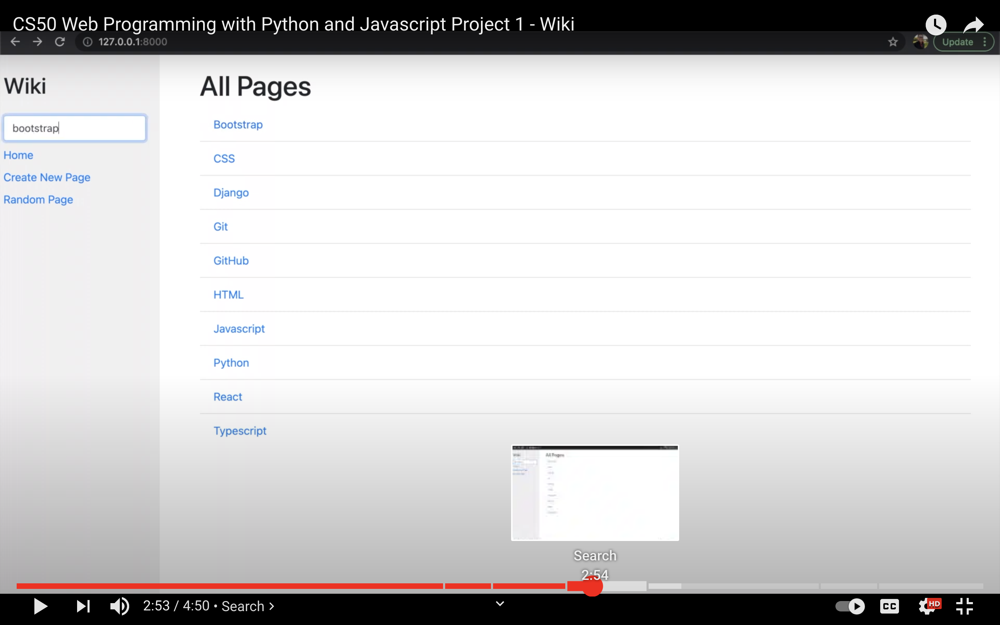

# Wiki: Django
### Homework from [Harvard's Web Programming with Python and Javascript CS50W hosted on eDX](https://www.edx.org/course/cs50s-web-programming-with-python-and-javascript)
### 🎓 [Project 1](https://cs50.harvard.edu/web/2020/projects/1/wiki/)
- Wiki: Built wikipedia clone using Django. Entries are maintained as markdown files.
- I wrote all the code in this repository.

## 🖥 Walkthrough on Youtube

## 💡Lessons Learned
- Using Django to build a basic web application
- Using standard Django conventions
- Converting Markdown files into HTML so the browser can display the formatted text
